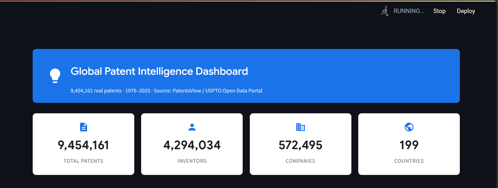
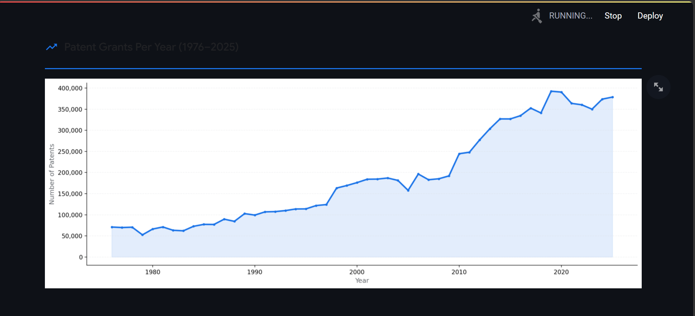
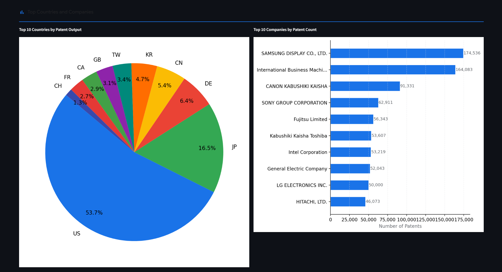
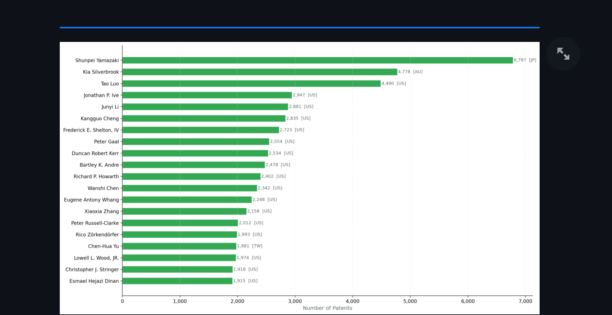
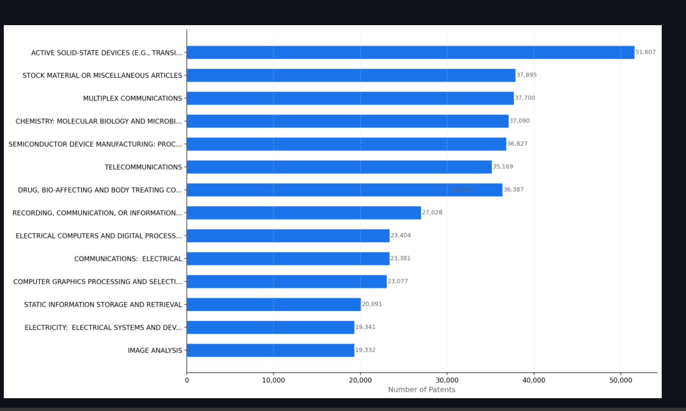
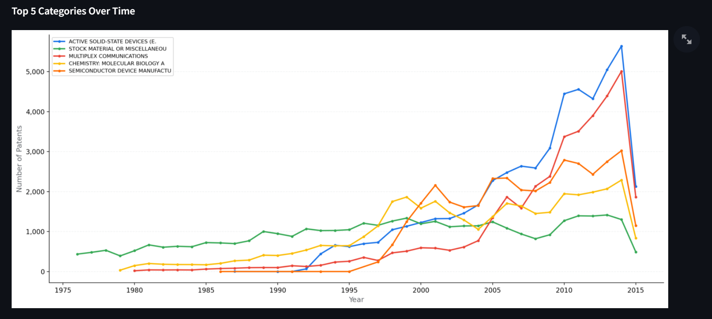

# Global Patent Intelligence Data Pipeline

A complete, professional-grade data engineering pipeline that collects, cleans, stores, analyzes, and visualizes **9,454,161 real patent records** from **1976 to 2025**.

**Data Source:** PatentsView / USPTO Open Data Portal
**GitHub:** https://github.com/MahamatAbdelrassoul/patent-pipeline

---

## Dashboard Preview

### KPI Overview

### Patent Grants Per Year (1976-2025)

### Top Countries and Companies

### Top 20 Inventors

### Advanced Category Analysis

### Top 5 Categories Over Time

### Patent Search Feature

---

## Tools and Technologies Used

| Tool         | Version  | Purpose                           |
| ------------ | -------- | --------------------------------- |
| Python       | 3.10     | Main programming language         |
| pandas       | 2.x      | Data cleaning and processing      |
| SQLite       | built-in | Database storage and queries      |
| Streamlit    | 1.28     | Interactive web dashboard         |
| matplotlib   | 3.7      | Data visualizations and charts    |
| Git + GitHub | -        | Version control and collaboration |

---

## Project Overview

This project builds a complete data pipeline following the architecture:

    Data Source (PatentsView TSV Files)
              ↓
    Python Scripts (Reading and Processing)
              ↓
    Clean Data using pandas
              ↓
    Store in SQLite Database
              ↓
    Analyze using SQL Queries (Q1-Q7)
              ↓
    Create Reports (Console + CSV + JSON)
              ↓
    Visualizations + Streamlit Dashboard

---

## Database

**Database:** SQLite (patents.db — 12 GB)

### Schema

    patents       (patent_id, title, abstract, filing_date, year)
    inventors     (inventor_id, name, country)
    companies     (company_id, name)
    relationships (id, patent_id, inventor_id, company_id)

### Database Statistics

| Table         | Rows       |
| ------------- | ---------- |
| patents       | 9,454,161  |
| inventors     | 4,294,034  |
| companies     | 572,495    |
| relationships | 25,305,316 |

---

## Code Files

| File                         | Description                                         |
| ---------------------------- | --------------------------------------------------- |
| scripts/fetch_data.py        | Reads TSV files and builds SQLite database directly |
| scripts/clean_data.py        | Exports clean CSV files from database               |
| scripts/load_db.py           | Verifies database integrity                         |
| scripts/generate_reports.py  | Runs all 7 SQL queries and generates reports        |
| scripts/visualizations.py    | Generates 4 PNG charts                              |
| scripts/category_analysis.py | Advanced patent category analysis                   |
| sql/schema.sql               | Database schema definition                          |
| sql/queries.sql              | All 7 analytical SQL queries                        |
| dashboard.py                 | Interactive Streamlit dashboard                     |

---

## SQL Queries (Q1 to Q7)

| #   | Query            | Description                                  | Result                            |
| --- | ---------------- | -------------------------------------------- | --------------------------------- |
| Q1  | Top Inventors    | Who has the most patents?                    | Shunpei Yamazaki — 6,787 patents  |
| Q2  | Top Companies    | Which companies own the most patents?        | Samsung Display — 174,536 patents |
| Q3  | Countries        | Which countries produce the most patents?    | USA — 54.38%                      |
| Q4  | Yearly Trends    | How many patents per year?                   | 70,941 (1976) to 378,741 (2025)   |
| Q5  | JOIN Query       | Combine patents with inventors and companies | Full joined dataset               |
| Q6  | CTE Query        | Multi-step analysis with WITH clause         | Avg patents per year per company  |
| Q7  | Window Functions | Rank inventors using RANK and NTILE          | Global and country-level rankings |

All queries are in sql/queries.sql

---

## Reports Generated

| File                                        | Description                               |
| ------------------------------------------- | ----------------------------------------- |
| reports/top_inventors.csv                   | Top 20 inventors by patent count          |
| reports/top_companies.csv                   | Top 20 companies by patent count          |
| reports/country_trends.csv                  | Top 20 countries with share percentage    |
| reports/yearly_trends.csv                   | Patent count per year 1976-2025           |
| reports/top_categories.csv                  | Top patent categories USPC classification |
| reports/report.json                         | Full summary in JSON format               |
| reports/chart_yearly_trends.png             | Line chart patents per year               |
| reports/chart_top_countries.png             | Pie chart top countries                   |
| reports/chart_top_companies.png             | Bar chart top companies                   |
| reports/chart_top_inventors.png             | Bar chart top inventors                   |
| reports/chart_top_categories.png            | Bar chart top categories                  |
| reports/chart_category_trends.png           | Line chart categories over time           |
| reports/chart_companies_in_top_category.png | Top companies in leading category         |

---

## Results Summary

| Metric              | Value                                       |
| ------------------- | ------------------------------------------- |
| Total Patents       | 9,454,161                                   |
| Years Covered       | 1976-2025                                   |
| Total Inventors     | 4,294,034                                   |
| Total Companies     | 572,495                                     |
| Total Countries     | 199                                         |
| Total Relationships | 25,305,316                                  |
| Top Country         | United States — 54.38%                      |
| Top Company         | Samsung Display — 174,536 patents           |
| Top Inventor        | Shunpei Yamazaki — 6,787 patents            |
| Top Category        | Active Solid-State Devices — 51,607 patents |

---

## Extra Features Implemented

### 1. Data Visualizations

7 professional charts generated using matplotlib:

- Patent grants per year (line chart with fill)
- Top 10 countries by patent output (pie chart)
- Top 10 companies by patent count (horizontal bar chart)
- Top 20 inventors by patent count (horizontal bar chart)
- Top 15 patent categories USPC (horizontal bar chart)
- Top 5 categories over time (multi-line chart)
- Top companies in leading category (horizontal bar chart)

### 2. Interactive Streamlit Dashboard

A professional web dashboard built with Streamlit and Google Material Design:

- Real-time KPI cards showing total patents, inventors, companies, countries
- Interactive yearly trends chart
- Top countries pie chart and top companies bar chart side by side
- Top 20 inventors chart with country labels
- Advanced category analysis section
- Interactive dropdown to explore any patent category
- Patent keyword search feature

### 3. Advanced Patent Category Analysis

Full analysis of patent categories using USPC classification:

- Top 15 patent categories ranked by volume
- Category trends over time (1976-2025)
- Top companies per category
- Interactive category explorer in dashboard

---

## Quick Start

### 1. Clone the repository

    git clone https://github.com/MahamatAbdelrassoul/patent-pipeline.git
    cd patent-pipeline

### 2. Install dependencies

    pip install requests pandas matplotlib streamlit

### 3. Download the data files

Go to:
https://data.uspto.gov/bulkdata/datasets/pvgpatdis?fileDataFromDate=1976-01-01&fileDataToDate=2025-09-30

Download and unzip these 6 files into data/raw/

- g_patent.tsv
- g_patent_abstract.tsv
- g_inventor_disambiguated.tsv
- g_assignee_disambiguated.tsv
- g_location_disambiguated.tsv
- g_uspc_at_issue.tsv

### 4. Run the full pipeline

    python scripts/fetch_data.py
    python scripts/clean_data.py
    python scripts/load_db.py
    python scripts/generate_reports.py
    python scripts/visualizations.py
    python scripts/category_analysis.py

### 5. Launch the interactive dashboard

    streamlit run dashboard.py

Then open your browser at: http://localhost:8501

---

## Clean Data Files

| File                     | Description                     |
| ------------------------ | ------------------------------- |
| data/clean_patents.csv   | Sample of clean patents table   |
| data/clean_inventors.csv | Sample of clean inventors table |
| data/clean_companies.csv | Full clean companies table      |

Full CSV files containing all 9,454,161 records are generated by running python scripts/clean_data.py

---

## Project Reproducibility

Anyone can clone this repository and reproduce all results by following the Quick Start steps above. The pipeline is fully automated — running the 6 scripts in order will rebuild the entire database, all reports, and all visualizations from scratch using the raw data files.

---

## About the Data

The PatentsView dataset is maintained by the USPTO (United States Patent and Trademark Office) and contains disambiguated patent grant data from 1976 to 2025. It includes information on inventors, assignees (companies), locations, classifications, and citations. The complete dataset contains 9,454,161 granted patents and is available at data.uspto.gov.
